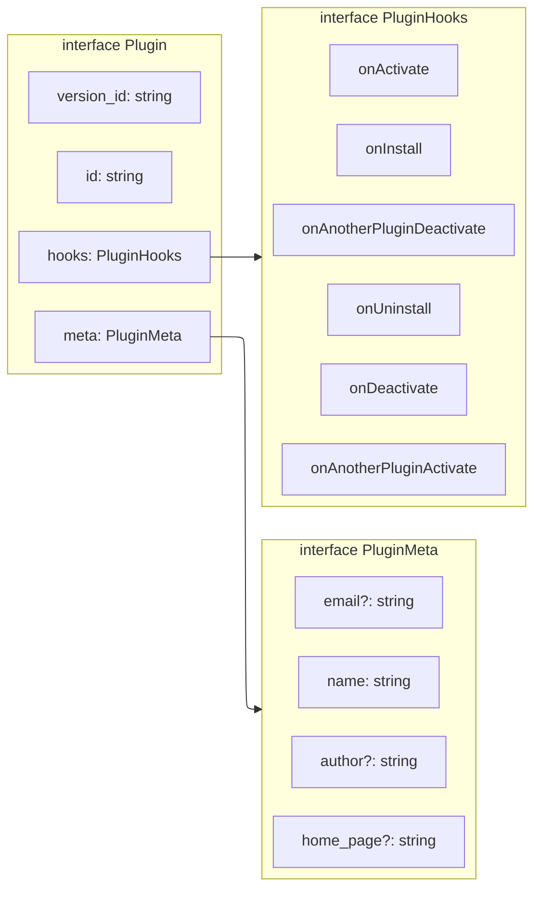

```mermaid
%%{init: {"flowchart": {"defaultRenderer": "elk"}}}%%
flowchart LR
  Plugin__meta ---> PluginMeta
  Plugin__hooks ---> PluginHooks
  subgraph PluginMeta["interface PluginMeta"]
    PluginMeta__name["name: string"]
    PluginMeta__author["author?: string"]
    PluginMeta__email["email?: string"]
    PluginMeta__home_page["home_page?: string"]
  end
  subgraph PluginHooks["interface PluginHooks"]
    PluginHooks__onInstall["onInstall"]
    PluginHooks__onUninstall["onUninstall"]
    PluginHooks__onActivate["onActivate"]
    PluginHooks__onDeactivate["onDeactivate"]
    PluginHooks__onAnotherPluginActivate["onAnotherPluginActivate"]
    PluginHooks__onAnotherPluginDeactivate["onAnotherPluginDeactivate"]
  end
  subgraph Plugin["interface Plugin"]
    Plugin__id["id: string"]
    Plugin__version_id["version_id: string"]
    Plugin__meta["meta: PluginMeta"]
    Plugin__hooks["hooks: PluginHooks"]
  end
```
